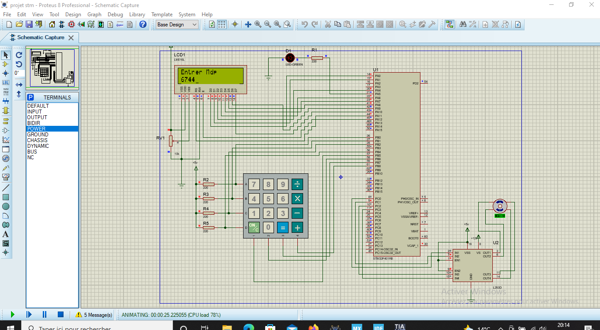
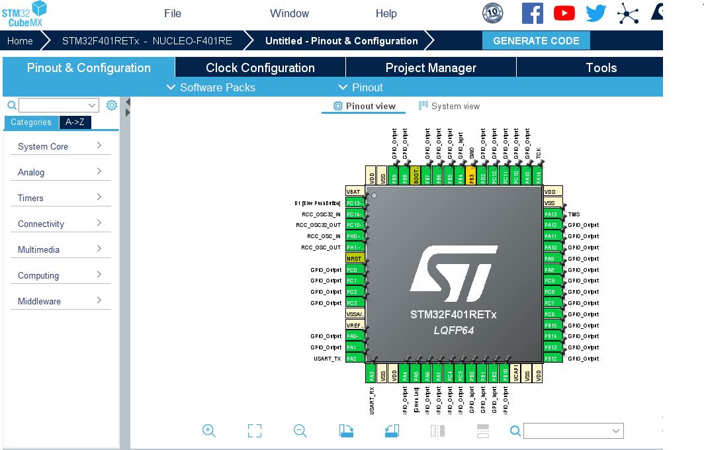
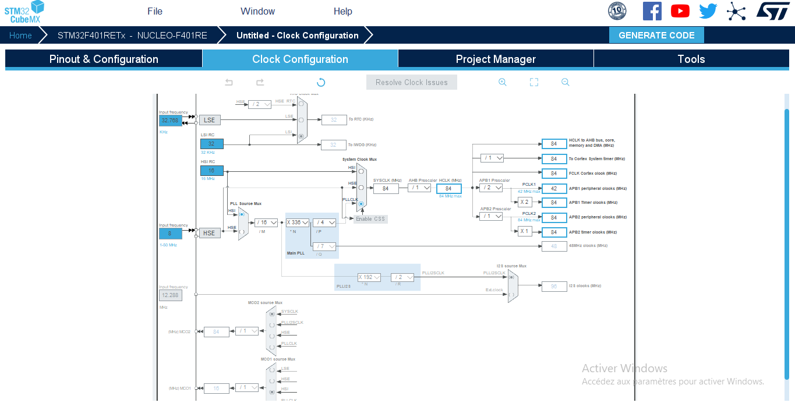

# **Secure Access System with STM32**

This project implements a password-based secure access system designed with an **STM32F401RE** microcontroller. The system manages access using a matrix keypad and provides visual feedback through an LCD display and LEDs. A motor (simulating an electronic lock) is activated when the correct password is entered.

## **Key Features**
- **Secure Password Entry**: A 4x4 matrix keypad allows users to enter a password.
- **Password Verification**: The microcontroller compares the user input with a predefined password.
- **Visual Feedback**:  
  - An LCD screen displays instructions and status messages (e.g., "Enter Password," "Access Granted").
  - A green LED lights up when the correct password is entered.
- **Motor Activation**: A DC motor is triggered via an L293D driver, simulating a door lock mechanism.
- **Extensibility**: The system can be expanded with additional technologies like RFID or Bluetooth communication.

## **Technologies Used**
- **STM32CubeMX**: Used to configure the STM32F401RE pins and generate initialization code.
- **STM32CubeIDE**: The integrated development environment for writing and debugging C code for STM32 microcontrollers.
- **Proteus 8 Professional**: Circuit simulation, including the keypad, LCD, LED, and motor.
- **STM32F401RE Microcontroller**: The system's core, responsible for input processing and peripheral management.

## **Programming Language**
This project is written in **C**, the standard language for STM32 microcontroller development. The use of C provides:
- Direct hardware access for efficient control.
- Compatibility with libraries like **HAL (Hardware Abstraction Layer)**, provided by STMicroelectronics.

The code utilizes functions such as:
- `HAL_GPIO_WritePin` for controlling GPIO pins.
- `HAL_Delay` for introducing delays.

The file structure includes essential components like:
- `main.c`: The main logic of the program.
- `stm32f4xx_hal_msp.c` and `stm32f4xx_it.c`: Files for hardware abstraction and interrupt handling, generated by **STM32CubeMX**.

## **Diagrams and Screenshots**
### **Proteus Circuit Diagram**

### **Pin Configuration in STM32CubeMX**

### **Clock Configuration in STM32CubeMX**

### **Code in STM32CubeIDE**
The code is developed and managed in **STM32CubeIDE**, as shown in the project structure and code organization.

## **How to Use This Project**
1. **Simulation in Proteus**:
   - Open the simulation file in Proteus.
   - Run the simulation to test functionality.
2. **Deployment on STM32**:
   - Import the CubeMX configuration into STM32CubeIDE.
   - Compile and upload the code to an STM32F401RE board.
3. **Interacting with the System**:
   - Enter the password using the matrix keypad.
   - Observe visual feedback (LEDs, LCD screen).
   - If the password is correct, the motor will activate.

## **Project Structure**
- **/Proteus**: Contains Proteus simulation files.
- **/CubeMX**: CubeMX configuration files.
- **/Code**: Generated and modified source code for STM32.

## **Possible Improvements**
- Adding a buzzer to signal errors or success.
- Implementing dual authentication with RFID or biometrics.
- Adding Bluetooth/Wi-Fi connectivity for remote control and monitoring.
- Introducing a temporary lockout after multiple failed attempts.
